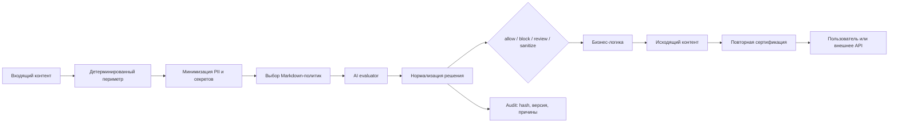

# Архитектура cBridge

## 1. Поток запроса

Детерминированный периметр всегда выполняется до ИИ:

- аутентификация и RBAC;
- ограничения размера и типа контента;
- schema validation;
- rate limits;
- защита от известных секретов;
- запрет неподдерживаемых маршрутов.

ИИ получает только смысловой контент после минимизации и не может отменить
жёсткий запрет периметра.

Каждый сертифицируемый маршрут обязан явно получить класс `standard`,
`personal`, `medical` или `secret`. Неизвестный класс даёт `review`, а
`secret` никогда не передаётся semantic evaluator.

## 2. Компоненты

| Компонент | Назначение |
|---|---|
| `contexts/` | Редактируемые Markdown-критерии |
| `scripts/build-context-bundle.mjs` | Проверяет и компилирует политики |
| `generated/context-bundle.json` | Runtime bundle для Worker |
| `src/certifier.js` | Оркестрация, timeout, fail-mode, нормализация |
| `src/redact.js` | Минимизация прямых идентификаторов и секретов |
| `src/evaluators/` | Подключаемые AI evaluator adapters |
| `src/symptom-book.js` | Локальный runtime-индекс шести архивных схем |
| `src/cloudflare.js` | Middleware для Worker request/response |
| `schemas/` | Формальный контракт решения |
| `tests/` | Регрессия политик и ядра |

## 3. Решение

Каждое решение содержит:

- `traceId`;
- направление и канал;
- verdict;
- risk/quality score;
- reason codes и нарушения;
- версии и hashes применённых политик;
- hash payload без сохранения самого payload;
- evaluator/model;
- время обработки;
- признак использования fail-mode.

Raw payload по умолчанию не сохраняется.

## 4. Fail-modes

Рекомендуемые значения:

| Поток | При недоступном evaluator |
|---|---|
| Исходящий медицинский ответ пациенту | `closed` → block |
| Исходящий ответ внешнего API | `closed` → block |
| Входящее сообщение пациента | `review` → безопасный ручной маршрут |
| Внутренняя низкорисковая аналитика | `open` только после отдельного решения |

## 5. Медицинские данные

Жалоба после удаления имени всё равно остаётся медицинскими данными. Поэтому
evaluator должен явно объявить capability `medicalData: true`, а поставщик и
регион обработки должны быть одобрены владельцем продукта и юридическим
контуром. Без этой capability cBridge возвращает `review` и не отправляет
payload evaluator-у.

Закрытый тестовый маршрут `POST /api/cbridge/diagnose` является отдельным
исключением только по способу обработки: медицинский текст остаётся внутри
Worker и детерминированно сопоставляется с runtime-индексом, составленным из
`data/aidadoc-serdce/flowcharts.md`. До и после сопоставления cBridge создаёт
решения `review`, но внешний AI evaluator не вызывается даже при будущей смене
общей capability. Ответ может показывать совпавшие разделы, красные флаги и
уточняющие вопросы, но всегда маркируется как архивный демонстрационный разбор,
а не диагноз или клиническая рекомендация.

## 6. Режимы запуска

1. `disabled` — middleware не подключён.
2. `observe` — решения считаются и аудируются, но не блокируют; нельзя применять
   к утечкам секретов и другим deterministic hard blocks.
3. `enforce` — решения управляют пропуском контента.

Переход в `enforce` выполняется после golden tests, нагрузочной проверки,
анализа false positive/negative и ручного утверждения bundle.

## 7. Cloudflare

При подключении к текущему Worker:

- добавить `main` в `web/wrangler.jsonc`;
- добавить assets binding `ASSETS`;
- направить `/api/*` через Worker с `run_worker_first`;
- импортировать `createCertifiedHandler` из `@aidadoc/cbridge/cloudflare`;
- хранить audit events в D1;
- хранить AI credentials только через Wrangler secrets;
- не включать raw JSON симптомайзера в assets.

Static Assets продолжают обслуживаться напрямую. cBridge применяется к API и
другим content-bearing маршрутам.
